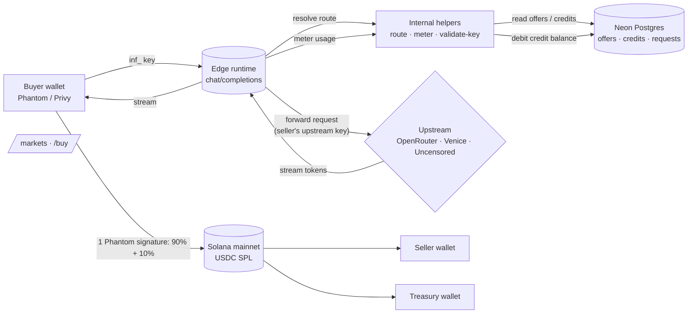

<div align="center">

  <h1>LLM Mart</h1>

  <p><b>The marketplace for AI inference.</b></p>

  <p>GPT-4, Claude, Llama, Gemini and 350+ other models — <b>70 to 90% off</b> sticker price.</p>

  <p>Sellers resell their leftover OpenRouter / Venice AI / Uncensored AI credit.<br/>
  Buyers pay them in USDC on Solana, then call any model through one OpenAI-compatible API.</p>

  <p>
    <a href="https://tryllmmart.com"></a>
    <a href="https://x.com/LLMmart"></a>
    <a href="LICENSE"></a>
  </p>

  <p>
    
    
    
    
    
    
    
    
  </p>

  <p> <a href="https://openrouter.ai"></a> <a href="https://venice.ai"></a> <a href="https://uncensored.chat"></a></p>

</div>

---

## Table of contents

- [What it is](#what-it-is)
- [Why it exists](#why-it-exists)
- [How it works](#how-it-works)
- [Architecture](#architecture)
- [Tech stack](#tech-stack)
- [Features](#features)
- [Getting started](#getting-started)
- [Environment variables](#environment-variables)
- [Deployment](#deployment)
- [API reference](#api-reference)
- [End-to-end smoke test](#end-to-end-smoke-test)
- [Roadmap](#roadmap)
- [License](#license)

---

## What it is

LLM Mart is a **peer-to-peer marketplace for AI inference**, settled on Solana in USDC.

- **Sellers** hold accounts on OpenRouter, Venice AI, or Uncensored AI with credit they aren't fully using. They list any model from those providers at a price-per-million-tokens of their choosing.
- **Buyers** pick a seller, click *Buy*, and pay them directly on chain — 90% goes to the seller's wallet, 10% to the platform treasury, in **one signed transaction**.
- After topping up, the buyer's `inf_…` API key spends those credits against any OpenAI-compatible client (OpenAI SDK, Anthropic SDK, Claude Code, curl). No popups per request.

There is no escrow, no custodial treasury, no monthly plan, no withdrawal step for sellers. USDC moves wallet → wallet on chain at top-up time, and the gateway routes API calls through whichever seller has the cheapest live credit balance for the requested model.

---

## Why it exists

People who buy API credit from OpenRouter, Venice, Uncensored, etc. rarely burn through all of it. Models reprice constantly, new providers undercut weekly, and a $500 prepay easily becomes $400 sitting idle. LLM Mart turns that idle credit into a tradable asset:

- **Sellers** recover value they would have otherwise wasted.
- **Buyers** get the same model output for a fraction of sticker price.
- **Platform** takes a flat 10% on each top-up — no per-request markup.

---

## How it works

### Buyer flow (3 steps)

1. **Browse `/markets`** — every model shows its sellers and their per-million-token price, sorted by discount vs the direct API rate.
2. **Click *Buy*** on a seller — choose how much USDC of credit to buy, sign **one Phantom transaction**. 90% lands in the seller's wallet, 10% in the treasury, atomically.
3. **Mint an `inf_…` key** at `/buy` and use it like any OpenAI key. Each request automatically routes to the cheapest seller you hold credit with, debits your balance with that seller, and streams the response back.

When a seller's balance runs out, the API returns `402 insufficient_credits` and the buyer tops up again.

### Seller flow (3 steps)

1. Go to `/sell` → **Create Offer** → pick model id, choose upstream provider (OpenRouter / Venice / Uncensored), paste your API key (stored AES-GCM encrypted at rest), set your price.
2. When buyers top up, USDC arrives in your wallet **immediately**, on chain. No payout schedule.
3. When the routed requests come in, they hit your upstream key. Your margin = your listed price − your actual upstream cost − the 10% platform fee.

### Routing order

For every chat completion the router tries, in order:

1. **Priority key** (buyer's own OpenRouter / OpenAI key, if configured in Router Settings).
2. **Cheapest healthy marketplace seller** the buyer holds credit with.
3. **Fallback key** (buyer's own, if configured).

Unhealthy upstreams are skipped for 60 seconds, then re-tried. Daily seller capacity caps drain to the next-cheapest seller automatically.

---

## Architecture



- **Edge runtime** (`/api/inference/v1/chat/completions`) is OpenAI-compatible and handles streaming.
- **Node runtime** helpers under `/api/internal/*` are gated by a shared secret and do DB work.
- **Neon Postgres** stores users, offers, credit balances, credit purchases, and the request ledger.
- **Solana** handles every dollar movement — there is no custodial treasury for the seller side.

---

## Tech stack

| Layer | Tech |
| --- | --- |
| Framework | **Next.js 16** (App Router, Turbopack) |
| Language | **TypeScript** strict |
| Styling | **Tailwind v4**, custom CSS variables, Radix primitives |
| Auth | **Privy** (email, Google, Phantom, Solflare, embedded wallets) |
| Database | **Neon Postgres** + **Drizzle ORM** |
| Chain | **Solana mainnet** via `@solana/web3.js` + `@solana/spl-token` |
| Settlement asset | **USDC** (SPL token mint `EPjFWdd5AufqSSqeM2qN1xzybapC8G4wEGGkZwyTDt1v`) |
| Upstream providers | **OpenRouter**, **Venice AI**, **Uncensored AI** |
| State / fetch | SWR |
| Hosting | Vercel (edge + node runtimes) |

---

## Features

- **One-signature credit purchase** — buyer → seller (90%) + buyer → treasury (10%) in a single `Transaction` with two `transferChecked` instructions.
- **OpenAI-compatible streaming** — drop-in for `OpenAI`, `Anthropic`, and `Claude Code` clients via `base_url` override.
- **Multi-provider routing** — sellers can resell from OpenRouter (any of ~350 models), Venice AI (uncensored Llama / Mistral / etc.), or Uncensored AI (`uncensored-llama-3.3-70b` family).
- **Smart router** — priority → cheapest marketplace seller w/ credit → fallback. Unhealthy upstreams cool down for 60s.
- **Per-seller credit ledger** — atomic SQL debits, fail-closed on insufficient balance.
- **Live marketplace UI** — capability tags (TOOLS, VISION, REASONING, JSON, STREAMING), per-seller discount %, capacity, status dots, an inline SVG step chart of cumulative credit offered vs discount.
- **All modalities surfaced** — Text / Image / Video / Music / TTS / STT tabs filter by parsed `input->output` modality strings; counts shown live per tab.
- **AES-GCM-encrypted upstream keys** — seller secrets are encrypted with `MASTER_ENCRYPTION_KEY` before they hit the database.
- **Idempotent on-chain settlement** — every credit purchase tx hash is unique-indexed; replays return 409.
- **Splash screen + reveal animations** — once-per-session intro, aurora background, glass surfaces, hover lifts.
- **Edge-runtime inference path** — no cold start for the hot chat completions route.

---

## Getting started

```bash
# 1. install
pnpm install

# 2. env
cp .env.example .env.local       # then fill in (see table below)

# 3. db (Neon recommended; uses DATABASE_URL)
pnpm db:push

# 4. seed (creates the platform user row + sample offers)
pnpm seed

# 5. dev
pnpm dev -p 3000
```

Open <http://localhost:3000> and sign in with Phantom or email.

---

## Environment variables

| Key | Required | Description |
| --- | :---: | --- |
| `DATABASE_URL` | yes | Postgres connection string (Neon pooled URL works fine) |
| `NEXT_PUBLIC_PRIVY_APP_ID` | yes | From the Privy dashboard |
| `PRIVY_APP_SECRET` | yes | From the Privy dashboard |
| `MASTER_ENCRYPTION_KEY` | yes | 32 bytes base64. Encrypts seller upstream API keys at rest. Generate with `node -e "console.log(require('crypto').randomBytes(32).toString('base64'))"` |
| `TREASURY_PRIVATE_KEY` | yes | Base58 string or JSON array of bytes. Receives the 10% fee. `pnpm gen-keypair` creates one. |
| `NEXT_PUBLIC_TREASURY_ADDRESS` | yes | Public key of the treasury wallet |
| `NEXT_PUBLIC_SOLANA_CLUSTER` | yes | `mainnet-beta` or `devnet` |
| `NEXT_PUBLIC_USDC_MINT` | yes | `EPjFWdd5AufqSSqeM2qN1xzybapC8G4wEGGkZwyTDt1v` on mainnet |
| `SOLANA_RPC_URL` | yes | Mainnet RPC — Helius / publicnode / Triton (server-side reads) |
| `NEXT_PUBLIC_SOLANA_RPC_URL` | yes | Same as above (browser reads) |
| `OPENROUTER_API_KEY` | yes | Used by `scripts/refresh-pricing.ts` to fetch the model catalog + by sellers who choose OpenRouter as their upstream |
| `OPENROUTER_BASE_URL` | no | Defaults to `https://openrouter.ai/api/v1` |
| `NEXT_PUBLIC_APP_URL` | recommended | Your prod URL (used as `http-referer` on OpenRouter analytics) |
| `INTERNAL_SHARED_SECRET` | no | Gates `/api/internal/*` helper endpoints. Falls back to `MASTER_ENCRYPTION_KEY` |
| `PLATFORM_FEE_RATE` | no | Defaults to `0.10` (10%) |
| `NEXT_PUBLIC_PLATFORM_FEE_RATE` | no | Same value, exposed to the browser so UI shows the right % |
| `MIN_CHARGE_USDC` | no | Floor for marketplace pricing per request, defaults to `0.0005` |

---

## Deployment

**Vercel** is the recommended host — both the edge inference route and the Node helpers run there natively.

1. Import `github.com/ctrlshifthash/LLM-mart` as a new Vercel project, preset **Next.js**, root `./`.
2. Paste your `.env.local` contents into **Environment Variables** (Vercel parses each `KEY=VALUE` line).
3. Deploy.
4. After the first deploy, set `NEXT_PUBLIC_APP_URL` to your `https://tryllmmart.com` (or `*.vercel.app`) and redeploy.
5. In the **Privy dashboard → Allowed Origins**, add your prod URL or sign-in won't work.

Database stays on **Neon** (set via `DATABASE_URL`); the schema is applied with `pnpm db:push` against your prod DB.

---

## API reference

The endpoint is a drop-in OpenAI replacement.

```
POST https://tryllmmart.com/api/inference/v1/chat/completions
Authorization: Bearer inf_…
Content-Type: application/json
```

**curl**

```bash
curl -N https://tryllmmart.com/api/inference/v1/chat/completions \
  -H "Authorization: Bearer inf_your_key" \
  -H "Content-Type: application/json" \
  -d '{
    "model": "anthropic/claude-3.5-sonnet",
    "stream": true,
    "messages": [{"role": "user", "content": "hello"}]
  }'
```

**OpenAI SDK (Python)**

```python
from openai import OpenAI

client = OpenAI(api_key="inf_your_key", base_url="https://tryllmmart.com/api/inference/v1")
resp = client.chat.completions.create(
    model="openai/gpt-4o-mini",
    messages=[{"role": "user", "content": "hello"}],
    stream=True,
)
for chunk in resp:
    print(chunk.choices[0].delta.content or "", end="")
```

**Anthropic SDK / Claude Code**

```bash
export ANTHROPIC_BASE_URL=https://tryllmmart.com/api/inference/v1
export ANTHROPIC_API_KEY=inf_your_key
claude   # routes through LLM Mart
```

### Error codes

| Status | Body `code` | Meaning |
| --- | --- | --- |
| 401 | `unauthorized` | Missing or invalid `inf_` bearer |
| 402 | `insufficient_credits` | No seller has credit with you for this model — buy more on `/markets` |
| 503 | `no_provider` | No active seller for this model |
| 503 | `all_failed` | Every routed attempt errored — last upstream error in `message` |

---

## End-to-end smoke test

A real-money script that signs a credit purchase from a buyer keypair and then calls the API with the resulting credit, printing every Solscan tx link along the way.

```bash
# requires extra env in .env.local:
#   BUYER_PRIVATE_KEY   base58 or JSON array (the buyer wallet — must hold USDC)
#   E2E_API_KEY         a freshly minted inf_ key for that buyer
#   E2E_SELLER_USER_ID  the uuid of any active seller
#   E2E_AMOUNT_USDC     optional, default 0.5
#   E2E_MODEL           optional, default openai/gpt-4o-mini

pnpm test:e2e
```

Steps printed in order:

1. Resolve buyer / seller / offer + verify the `inf_` key matches
2. Check buyer wallet USDC balance
3. Build, sign, and broadcast the 2-instruction USDC transfer (buyer → seller + buyer → treasury)
4. Verify on-chain confirmation matches the quoted amounts
5. Record `credit_purchases` + bump the buyer's per-seller credit balance
6. Call `/v1/chat/completions`
7. Confirm the credit was debited by the metering helper

If every step green-checks, the full chain — Phantom signing → on-chain split → DB credit row → API auth → upstream call → token debit — is healthy.

---

## Roadmap

- [ ] Anthropic native `/v1/messages` adapter so Anthropic SDK users don't need the `chat/completions` shape
- [ ] Per-provider model catalog fetch (Venice / Uncensored model IDs auto-populate in the seller dropdown)
- [ ] Real-time activity stream on `/markets` (WebSocket-fed "Recent Trades")
- [ ] Seller analytics: margin curves, churn, model mix
- [ ] Multi-sig treasury for fee management
- [ ] Devnet smoke-test environment for contributors

---

## Links

- **Live**: [tryllmmart.com](https://tryllmmart.com)
- **X / Twitter**: [@LLMmart](https://x.com/LLMmart)
- **Issues / PRs**: [github.com/ctrlshifthash/LLM-mart/issues](https://github.com/ctrlshifthash/LLM-mart/issues)

---

## License

MIT
